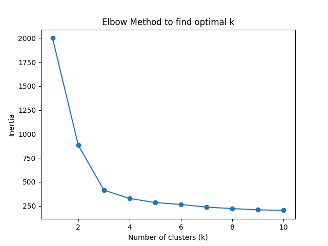
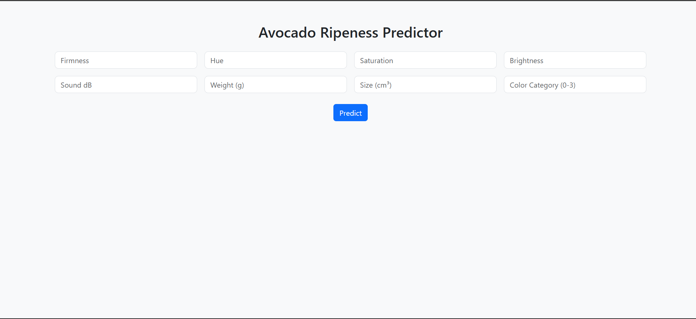
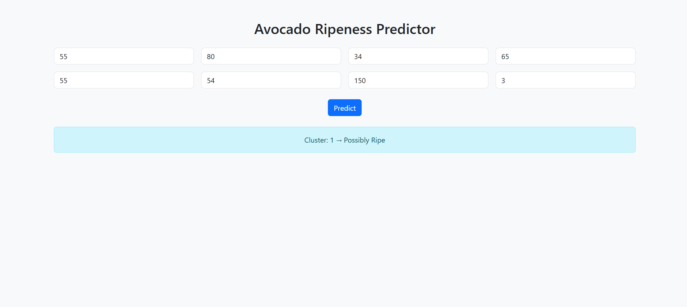

This is my local README content
This is the version on GitHub

# 🥑 Avocado Ripeness Classification using K-Means Clustering


> A full-stack Machine Learning project that classifies the ripeness of avocados using unsupervised learning (K-Means). Complete with EDA, clustering logic, Flask API, frontend UI, Dockerization, and optional CI/CD integration — all in one deployable application.

---

## 📌 Problem Statement

In the food and agriculture industry, detecting the ripeness of fruits like avocados is a **real-world problem**. Most assessments are visual, subjective, and often inaccurate — leading to:

- Premature harvesting
- Reduced shelf life
- Waste and economic loss

### ❓ Can we use **data-driven clustering** to predict the ripeness of avocados?

---

## 🎯 Project Goals

✅ Use sensor-based data to classify ripeness  
✅ Apply unsupervised ML (K-Means) with no labels  
✅ Deploy a web app for real-time prediction  
✅ Dockerize for easy sharing  
✅ Host API using Flask + Render  

---

## 🛠️ Tools & Technologies

| Category           | Tools/Libraries |
|-------------------|-----------------|
| ML & Scaling       | `scikit-learn`, `KMeans`, `StandardScaler` |
| Data Handling      | `pandas`, `numpy`, `matplotlib`, `seaborn` |
| API / Backend      | `Flask`, `Flask-CORS`, `joblib`, `gunicorn` |
| UI / Frontend      | `HTML`, `CSS`, `Bootstrap` |
| Deployment         | `Docker`, `Render`, `Postman` |
| Version Control    | `Git`, `GitHub` |

---

## 🧠 Dataset Overview

The dataset was collected from a combination of physical and color-based measurements of avocados at different ripeness stages.

### 📊 Features Used:

- `firmness` – softness/hardness level  
- `hue` – color tone (spectrum)  
- `saturation`, `brightness` – color depth  
- `sound_db` – sound level when tapped  
- `weight_g`, `size_cm3` – physical properties  
- `color_category_encoded` – manually encoded color label  

All features were **numeric** and **cleaned (no missing values)** before training.

---

## 📈 Exploratory Data Analysis

We visualized patterns using heatmaps, histograms, and box plots to explore feature correlations.

### 🔍 Elbow Method to determine `k`



Optimal number of clusters: **k = 3**

---

## 🔬 Model Development

### ✅ Preprocessing

- Applied `StandardScaler` to normalize all features
- Used `OrdinalEncoder` for `color_category`

### ✅ Clustering

- Applied `KMeans(n_clusters=3)`
- Saved both the model (`kmeans_model.pkl`) and scaler (`scaler.pkl`)

### ✅ Interpretation of Clusters:

| Cluster | Meaning           |
|---------|-------------------|
| 0       | Likely **Unripe** |
| 1       | Possibly **Ripe** |
| 2       | Possibly **Overripe** |

---

## 🖥️ Web App (Flask + HTML)

A lightweight web form allows users to input avocado data and receive a ripeness prediction.




---

## 📽️ Demo Video

 
[▶️ Click to Watch the App in Action](https://www.youtube.com/results?search_query=Predict+Avocado+Ripeness+with+Machine+Learning+%7C+K-Means+Clustering)

---

## ⚙️ Docker Deployment

### Build Image:
```bash
docker build -t avocado-kmeans-app .
=======
🥑 Avocado Ripeness Classification using K-Means Clustering
A full-stack Machine Learning project that classifies avocado ripeness using unsupervised learning (K-Means). This project includes exploratory data analysis (EDA), clustering logic, a Flask API, a frontend UI, Dockerization, and optional CI/CD integration—all in a deployable application.
📌 Problem Statement
In the food and agriculture industry, assessing avocado ripeness is often visual, subjective, and inaccurate, leading to premature harvesting, reduced shelf life, and economic loss. This project uses data-driven clustering to predict avocado ripeness based on sensor data.
🎯 Project Goals

✅ Classify ripeness using sensor-based data
✅ Apply unsupervised ML (K-Means) without labels
✅ Deploy a web app for real-time predictions
✅ Dockerize for easy sharing
✅ Host API using Flask and Render

🛠️ Tools & Technologies


Category
Tools/Libraries


ML & Scaling
scikit-learn, KMeans, StandardScaler


Data Handling
pandas, numpy, matplotlib, seaborn


API / Backend
Flask, Flask-CORS, joblib, gunicorn


UI / Frontend
HTML, CSS, Bootstrap


Deployment
Docker, Render, Postman


Version Control
Git, GitHub


🧠 Dataset Overview
The dataset combines physical and color-based measurements of avocados at different ripeness stages. It is cleaned (no missing values) and contains the following numeric features:

firmness: Softness/hardness level
hue: Color tone (spectrum)
saturation, brightness: Color depth
sound_db: Sound level when tapped
weight_g, size_cm3: Physical properties
color_category_encoded: Manually encoded color label

📈 Exploratory Data Analysis (EDA)
EDA was performed to understand feature distributions and relationships before clustering.
🔍 Visualizations

🔸 Clusters by Firmness and Brightness (images/Clusters by Firmness and Brightness):
Description:This plot visualizes the clustering result using only two key features: firmness and brightness. It provides a simple, intuitive view of how the algorithm distinguishes groups based on these physical attributes.


🔸 Clusters Visualized with PCA (images/Clusters visualized with PCA):
Description:This PCA-based visualization reduces the feature space to two dimensions while retaining the most important variance. It offers a broader view of how well the clusters are formed across all features.

Pair Plot (images/pair_plot.png):

Description: A scatter plot matrix showing pairwise relationships and histograms for features (firmness, hue, saturation, brightness, sound_db, weight_g, size_cm3). It highlights potential clusters in the data.
Purpose: Confirms natural groupings, supporting the use of K-Means clustering.


Correlation Heatmap (images/correlation_heatmap.png):

Description: A heatmap of the correlation matrix for all features, with values from -1 to 1. Red indicates positive correlations, blue indicates negative.
Purpose: Identifies strong feature relationships (e.g., firmness vs. hue) that influence clustering.


Elbow Method Plot (images/elbow_plot.png):

Description: A line plot of Within-Cluster Sum of Squares (WCSS) for varying k in K-Means. The "elbow" at k=3 indicates the optimal number of clusters.
Purpose: Determines the best number of clusters for K-Means.


Key Insight
The pair plot and correlation heatmap revealed potential groupings, with firmness and hue showing strong correlations, justifying K-Means with k=3.
🔬 Model Development
✅ Preprocessing

Applied StandardScaler to normalize features.
Used OrdinalEncoder for color_category.

✅ Clustering

Implemented KMeans(n_clusters=3) to classify avocados into three ripeness stages.
Saved the model (models/kmeans_model.pkl) and scaler (models/scaler.pkl) for deployment.

✅ Cluster Interpretation


Cluster
Meaning


0
Likely Unripe


1
Possibly Ripe


2
Possibly Overripe


🖥️ Web App (Flask + HTML)
A user-friendly web interface, built with Flask and Bootstrap, allows users to input avocado features and receive ripeness predictions.
Screenshots

Web Form (images/web_form.png):

Description: A Bootstrap-based form for inputting feature values (e.g., firmness, hue).
Purpose: Enables easy user interaction for real-time predictions.


Prediction Output (images/prediction_result.png):

Description: Displays the predicted ripeness (e.g., "Unripe", "Ripe", "Overripe") after form submission.
Purpose: Presents model output clearly.


📽️ Demo Video
## 📽️ Demo Video

🎥 **Demo on YouTube:**  
[▶️ Click to Watch the App in Action](https://www.youtube.com/watch?v=eCLJEETtFbA)
The video shows the web app workflow, from feature input to prediction output.
⚙️ Docker Deployment
Build and Run
# Build Docker image
docker build -t avocado-kmeans-app .

# Run container
docker run -p 5000:5000 avocado-kmeans-app

Deployment on Render

Push the Docker image to a container registry (e.g., Docker Hub).
Deploy on Render using the Dockerfile and gunicorn (configured in Procfile).
Test the API using Postman or the web UI at http://localhost:5000.

🚀 Optional CI/CD Integration

Use GitHub Actions to automate testing, building, and deploying the Docker image to Render.
Workflow: Lint code → Run unit tests → Build Docker image → Push to Docker Hub → Deploy to Render.

📂 Project Structure
avocado-kmeans-app/
├── images/                  
│   ├── pair_plot.png
│   ├── correlation_heatmap.png
│   ├── elbow_plot.png
│   ├── web_form.png
│   ├── prediction_result.png
├── scaler.pkl
├── style.css
├──  index.html
├── .gitignore               
├── app.py                  
├── Dockerfile              
├── LICENSE                
├── Procfile                
├── README.md               
├── requirements.txt        

🛠️ Setup Instructions

Clone the Repository:git clone https://github.com/your-repo/avocado-kmeans-app.git
cd avocado-kmeans-app


Install Dependencies:pip install -r requirements.txt


Run Locally:python app.py

Access the app at http://localhost:5000.
Run with Docker:docker build -t avocado-kmeans-app .
docker run -p 5000:5000 avocado-kmeans-app


Deploy to Render:
Push the Docker image to Docker Hub.
Configure Render with the repository and Procfile.
Deploy and test via the Render dashboard.


📝 Notes

The .gitignore file excludes temporary files, model artifacts (e.g., *.pkl), and sensitive data to keep the repository clean.
The LICENSE file (e.g., MIT) defines the terms for using and distributing the project.
The Procfile specifies the command for Render deployment (e.g., gunicorn app:app).

🛠️ Future Improvements

Integrate real-time sensor data for automated feature collection.
Add interactive visualizations (e.g., Plotly) to the UI.
Explore alternative clustering algorithms (e.g., DBSCAN).

📧 Contact
For questions or contributions, open an issue at GitHub Issues.
>>>>>>> 8226895 (for local machine)
